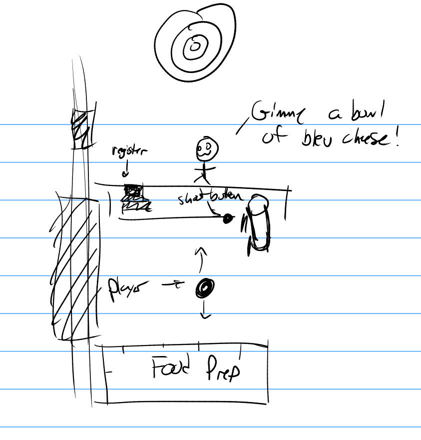

## BARISTA SIMULATOR 2024

# About the game
This game was created over 48 hours (Jan 26 - Jan 28 2024, 5pm - 5pm) for RIT's Global Game jam.
This was all of our first times in a game jam, and half of us had never touched Godot before. We spent as much time learning how to create a game as we did actually creating it.
I'll be honest: this isn't a _good_ game. But it's a game - one of our first games - and it was done under a serious time crunch. I, at least, am proud of how it turned out.

# How do you play this game?
It's simple, really. Kinda intuitive. I bet you feel foolish for even asking. But here goes.
- Press SPACE to switch between the customers & the backroom.
- Click on the elements to add them to the meal
- When done, click the green button to load the CANNON.
- Click on the cannon whenever you're ready!

## Food Drink Items
- Drinks
  - Coffee
  - Milk
  - "Vegan" milk
- Additions
  - Mayo
  - Whipped Cream
  - Chocolate
  - Caramel
- Bowl Items
  - Fruit
  - Small Fry
  - Bleu Cheese

## Job management
- Goose
  - Artwork
- Gabe
  - Camera system
- Sarah
  - UI/level design
  - Click & Drag functionality
- Nikki 
  - Physics interactions (CANNON)
  - Creating customers
- All
  - Coding (as needed)

## Concepts/sketches

